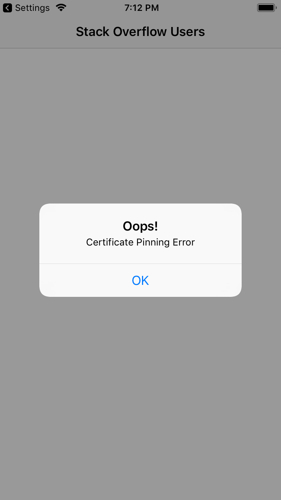

# SSL Pinning with Alomafire

## Understand TLS


### The Three Phases of TLS Connections

- In the first phase, the client initiates a connection with the server.

- The client then sends the server a message, which lists the versions of TLS it can support along with the cipher suite it can use for encryption.

The server responds with the selected **cipher suite** and sends one or more **digital certificates** back to the client.

- The client verifies that those digital certificates — certificates, for short — are valid. It also verifies that the server is authentic and not someone who wants to snoop sensitive information.

- If the validation succeeds, the second phase of verification begins. The client generates a **pre-master secret key** and encrypts it with the server’s public key — i.e., the public key included in the certificate.

- The server receives the **encrypted pre-master secret key and decrypts** it with its **private key**. The server and client each generate **the master secret key** and **session keys** based on the pre-master secret key.

> Note: The second phase uses public-key cryptography or asymmetric cryptography. This is a cryptographic system that uses pairs of keys: Public keys, which are widely disseminated and private keys, which only the owner knows.

- That master secret key is then used in the last phase to decrypt and encrypt the information that the two actors exchange.

> Note: The third phase uses symmetric-key cryptography, where you use the same key for both encryption of plaintext and decryption of ciphertext.

### About Digital Certificates

A certificate is a file that encapsulates information about the server that owns the certificate. It’s similar to an identification card, such as a passport or a driver license.

A Certificate Authority (CA) can issue a certificate or it can be self-signed. In the first case, the CA must validate the identity of the certificate holder both before it issues the certificate and when your app uses the certificate. In the second case, the same entity whose identity it certifies signs the certificate.


### The Structure of a Digital Certificates


The structure of a certificate uses [X.509 standard](https://en.wikipedia.org/wiki/X.509). Here are the main fields:

- Subject: Provides the name of the entity (computer, user, network device, etc.) that the CA issued the certificate to.
- Serial Number: Provides a unique identifier for each certificate that a CA issues.
- Issuer: Provides a unique name for the CA that issued the certificate.
- Valid From: Provides the date and time when the certificate becomes valid.
- Valid To: Provides the date and time when the certificate is no longer considered valid.
- Public Key: Contains the public key of the key pair that goes with the certificate.
- Algorithm Identifier: Indicates the algorithm used to sign the certificate.
- Digital Signature: A bit string used to verify the authenticity of the certificate.

X.509 certificates can be encoded differently, which will affect their appearance. The most common are:

- Privacy Enhanced Mail (PEM): A Base-64 encoding, whose file extension is .pem.
- Distinguished Encoding Rules (DER): A binary encoding, whose file extensions are .cer, .der and .crt.
- Public Key Cryptography Standards (PKCS): Used to exchange public and private objects in a single file. Its extensions are .p7b, .p7c, .p12, .pfx etc.


### Validating Digital Certificates


When you get a certificate from a CA, that certificate is part of a [chain of trust](https://en.wikipedia.org/wiki/Chain_of_trust), or a chain of certificates.


During a certificate validation, the app verifies:

- The date of evaluation, which must fall between the Valid From and Valid To fields of the certificate for the certificate to be valid.
- The digital signature, by finding the public key of the next issuing CA or intermediate CA. The process continues until it reaches the root certificate.

> Note: iOS keeps all well-known root CA certificates in its Trust Store. If you want to know the trusted root certificates that come pre-installed with iOS, please refer to [Apple’s lists of available trusted root certificates in iOS](https://support.apple.com/en-us/HT204132).

## SSL Certificate Pinning Under the Hood

SSL Certificate Pinning, or pinning for short, is the process of associating a host with its certificate or public key. Once you know a host’s certificate or public key, you pin it to that host.

In other words, you configure the app to reject all but one or a few predefined certificates or public keys. Whenever the app connects to a server, it compares the server certificate with the pinned certificate(s) or public key(s). If and only if they match, the app trusts the server and establishes the connection.

You usually add a service’s certificate or public key at development time. In other words, your mobile app should include the digital certificate or the public key within your app’s bundle. This is the preferred method, since an attacker cannot taint the pin.

### Why Do You Need SSL Certificate Pinning?

Restricting the set of trusted certificates through pinning prevents attackers from analyzing the functionality of the app and the way it communicates with the server.

### Types of SSL Certificate Pinning

You can decide between two options:

- **Pin the certificate**: You can download the server’s certificate and bundle it into your app. At runtime, the app compares the server’s certificate to the one you’ve embedded.

- **Pin the public key**: You can retrieve the certificate’s public key and include it in your code as a string. At runtime, the app compares the certificate’s public key to the one hard-coded in your code.

Choosing between these two options depends on your needs and server configuration. If you choose the first option, you need to upload your app when your server rotates (changes) its certificate or it will stop working. If you choose the second option, it may violate key rotation policy because the public key doesn’t change.

> Note: As well as pinning the certificate or the public key, it’s also possible to pin **the subject public key info**. At the time of this writing, Alamofire is not able to perform this type of pinning. If you’re looking for such a solution, refer to TrustKit.

## Pinning in Alamofire 5

Alamofire 5 supports the pinning of both the certificate and the public key. In particular, it provides two different classes, called respectively `PinnedCertificatesTrustEvaluator` and `PublicKeysTrustEvaluator`, which allow you to deal with these cases.

### Getting Cert from StackExchange.com

Showing Cert:

```shell
openssl s_client -connect api.stackexchange.com:443 </dev/null
```

```shell
Certificate chain
 0 s:/C=US/ST=NY/L=New York/O=Stack Exchange, Inc./CN=*.stackexchange.com
   i:/C=US/O=DigiCert Inc/OU=www.digicert.com/CN=DigiCert SHA2 High Assurance Server CA
 1 s:/C=US/O=DigiCert Inc/OU=www.digicert.com/CN=DigiCert SHA2 High Assurance Server CA
   i:/C=US/O=DigiCert Inc/OU=www.digicert.com/CN=DigiCert High Assurance EV Root CA

Server certificate
-----BEGIN CERTIFICATE-----
MIIHMjCCBhqgAwIBAgIQBmgM1QeOzDnM9C33n9PrfTANBgkqhkiG9w0BAQsFADBw
MQswCQYDVQQGEwJVUzEVMBMGA1UEChMMRGlnaUNlcnQgSW5jMRkwFwYDVQQLExB3
d3cuZGlnaWNlcnQuY29tMS8wLQYDVQQDEyZEaWdpQ2VydCBTSEEyIEhpZ2ggQXNz
dXJhbmNlIFNlcnZlciBDQTAeFw0xNjA1MjEwMDAwMDBaFw0xOTA4MTQxMjAwMDBa
MGoxCzAJBgNVBAYTAlVTMQswCQYDVQQIEwJOWTERMA8GA1UEBxMITmV3IFlvcmsx
HTAbBgNVBAoTFFN0YWNrIEV4Y2hhbmdlLCBJbmMuMRwwGgYDVQQDDBMqLnN0YWNr
ZXhjaGFuZ2UuY29tMIIBIjANBgkqhkiG9w0BAQEFAAOCAQ8AMIIBCgKCAQEAr0YD
zscT5i6T2FaRsTGNCiLB8OtPXu8N9iAyuaROh/nS0kRRsN8wUMk1TmgZhPuYM6oF
S377V8W2LqhLBMrPXi7lnhvKt2DFWCyw38RrDbEsM5dzVGErmhux3F0QqcTI92zj
VW61DmE7NSQLiR4yonVpTpdAaO4jSPJxn8d+4p1sIlU2JGSk8LZSWFqaROc7KtXt
lWP4HahNRZtdwvL5dIEGGNWx+7B+XVAfY1ygc/UisldkA+a3D2+3WAtXgFZRZZ/1
CWFjKWJNMAI6ZBAtlbgSNgRYxdcdleIhPLCzkzWysfltfiBmsmgz6VCoFR4KgJo8
Gd3MeTWojBthM10SLwIDAQABo4IDzDCCA8gwHwYDVR0jBBgwFoAUUWj/kK8CB3U8
zNllZGKiErhZcjswHQYDVR0OBBYEFFrBQmPCYhOznZSEqjIeF8tto4Z7MIIB/AYD
VR0RBIIB8zCCAe+CEyouc3RhY2tleGNoYW5nZS5jb22CEXN0YWNrb3ZlcmZsb3cu
Y29tghMqLnN0YWNrb3ZlcmZsb3cuY29tgg1zdGFja2F1dGguY29tggtzc3RhdGlj
Lm5ldIINKi5zc3RhdGljLm5ldIIPc2VydmVyZmF1bHQuY29tghEqLnNlcnZlcmZh
dWx0LmNvbYINc3VwZXJ1c2VyLmNvbYIPKi5zdXBlcnVzZXIuY29tgg1zdGFja2Fw
cHMuY29tghRvcGVuaWQuc3RhY2thdXRoLmNvbYIRc3RhY2tleGNoYW5nZS5jb22C
GCoubWV0YS5zdGFja2V4Y2hhbmdlLmNvbYIWbWV0YS5zdGFja2V4Y2hhbmdlLmNv
bYIQbWF0aG92ZXJmbG93Lm5ldIISKi5tYXRob3ZlcmZsb3cubmV0gg1hc2t1YnVu
dHUuY29tgg8qLmFza3VidW50dS5jb22CEXN0YWNrc25pcHBldHMubmV0ghIqLmJs
b2dvdmVyZmxvdy5jb22CEGJsb2dvdmVyZmxvdy5jb22CGCoubWV0YS5zdGFja292
ZXJmbG93LmNvbYIVKi5zdGFja292ZXJmbG93LmVtYWlsghNzdGFja292ZXJmbG93
LmVtYWlsghJzdGFja292ZXJmbG93LmJsb2cwDgYDVR0PAQH/BAQDAgWgMB0GA1Ud
JQQWMBQGCCsGAQUFBwMBBggrBgEFBQcDAjB1BgNVHR8EbjBsMDSgMqAwhi5odHRw
Oi8vY3JsMy5kaWdpY2VydC5jb20vc2hhMi1oYS1zZXJ2ZXItZzUuY3JsMDSgMqAw
hi5odHRwOi8vY3JsNC5kaWdpY2VydC5jb20vc2hhMi1oYS1zZXJ2ZXItZzUuY3Js
MEwGA1UdIARFMEMwNwYJYIZIAYb9bAEBMCowKAYIKwYBBQUHAgEWHGh0dHBzOi8v
d3d3LmRpZ2ljZXJ0LmNvbS9DUFMwCAYGZ4EMAQICMIGDBggrBgEFBQcBAQR3MHUw
JAYIKwYBBQUHMAGGGGh0dHA6Ly9vY3NwLmRpZ2ljZXJ0LmNvbTBNBggrBgEFBQcw
AoZBaHR0cDovL2NhY2VydHMuZGlnaWNlcnQuY29tL0RpZ2lDZXJ0U0hBMkhpZ2hB
c3N1cmFuY2VTZXJ2ZXJDQS5jcnQwDAYDVR0TAQH/BAIwADANBgkqhkiG9w0BAQsF
AAOCAQEARIdUz7n08ZtqWscAmTXegtB6yPrU0l5IQCXQRqnEVXPKyS+w8IVOcblT
T/W2Qlp5we2BTDbRDfVokXIOSxOTAT0XN3f3c+nbvKJ3XMBH236846AY6bpfqL0/
05gcdt39d2iXTL+qnJW9P0yFKpkfGXBBTYQl4ACSeThSuSBXIVJ0v/TfR9+ggXuP
pmXiIKkPOReKu2Tu8SO7+5KRqRJvYhP9mhL4Bl+YLrTQXzM1NwVAahRT1QJJNemy
yEY1kkZOCKt0xRu4CVWhJlpNdoRZenT9BrD8Fo22kt5MxAvCVrjT/g1BHDQd4S8p
PKC8kRwmMA8mdo8TiHJQMy0DBCDCDg==
-----END CERTIFICATE-----
subject=/C=US/ST=NY/L=New York/O=Stack Exchange, Inc./CN=*.stackexchange.com
issuer=/C=US/O=DigiCert Inc/OU=www.digicert.com/CN=DigiCert SHA2 High Assurance Server CA
```


Saving Cert:

```shell
openssl s_client -connect api.stackexchange.com:443 </dev/null \
  | openssl x509 -outform DER -out stackexchange.com.der
```


Copy the `stackexchange.com.der` into the project


### Integrating with Alomafire 5

```swift
struct Certificates {
  static let stackExchange =
    Certificates.certificate(filename: "stackexchange.com")
  
  private static func certificate(filename: String) -> SecCertificate {
    let filePath = Bundle.main.path(forResource: filename, ofType: "der")!
    let data = try! Data(contentsOf: URL(fileURLWithPath: filePath))
    let certificate = SecCertificateCreateWithData(nil, data as CFData)!
    
    return certificate
  }
}

----

// 1
let evaluators = [
  "api.stackexchange.com":
    PinnedCertificatesTrustEvaluator(certificates: [
      Certificates.stackExchange
    ])
]

let session: Session

// 2
private init() {
  session = Session(
    serverTrustManager: ServerTrustManager(evaluators: evaluators)
  )
}

----

NetworkClient.request(Router.users)
  .responseDecodable { (response: DataResponse<UserList>) in
    switch response.result {
    case .success(let value):
      self.users = value.users
    case .failure(let error):
      let isServerTrustEvaluationError =
        error.asAFError?.isServerTrustEvaluationError ?? false
      let message: String
      if isServerTrustEvaluationError {
        message = "Certificate Pinning Error"
      } else {
        message = error.localizedDescription
      }
      self.presentError(withTitle: "Oops!", message: message)
    }
}
```

## Testing Certificate Pinning With Charles




---

https://www.raywenderlich.com/1484288-preventing-man-in-the-middle-attacks-in-ios-with-ssl-pinning